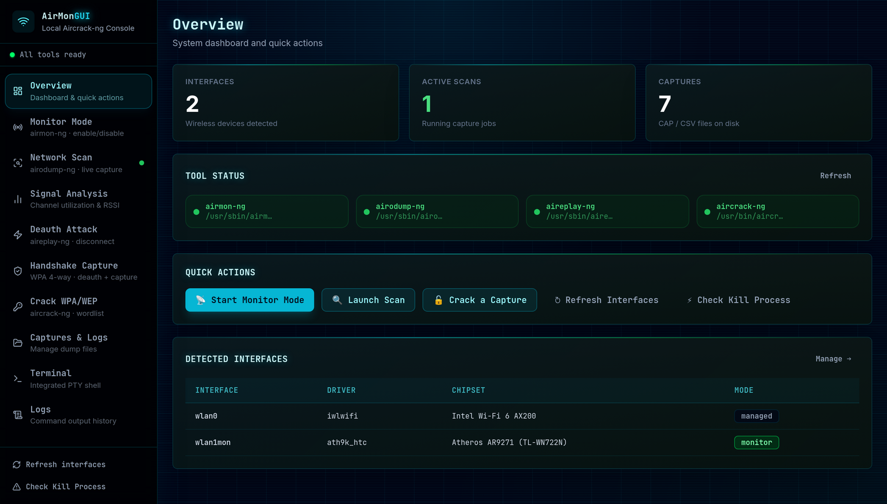
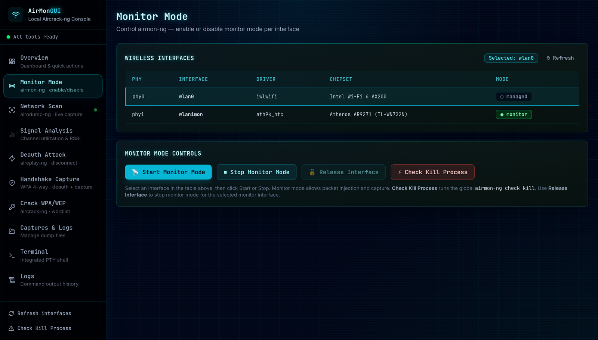
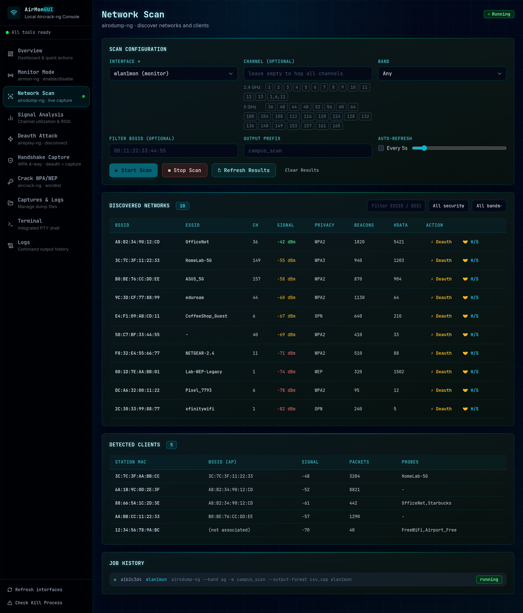
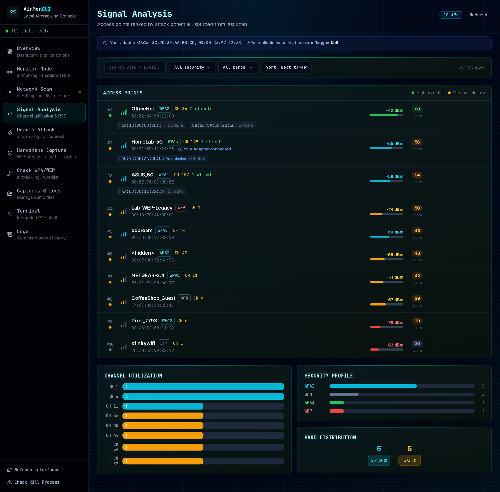
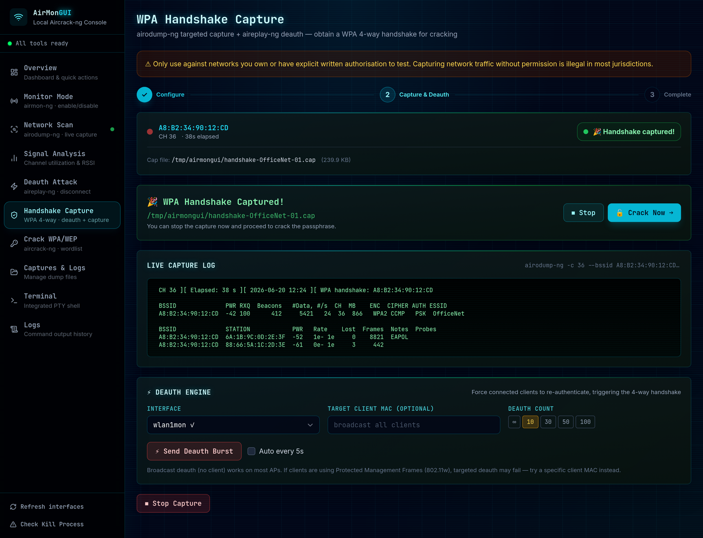
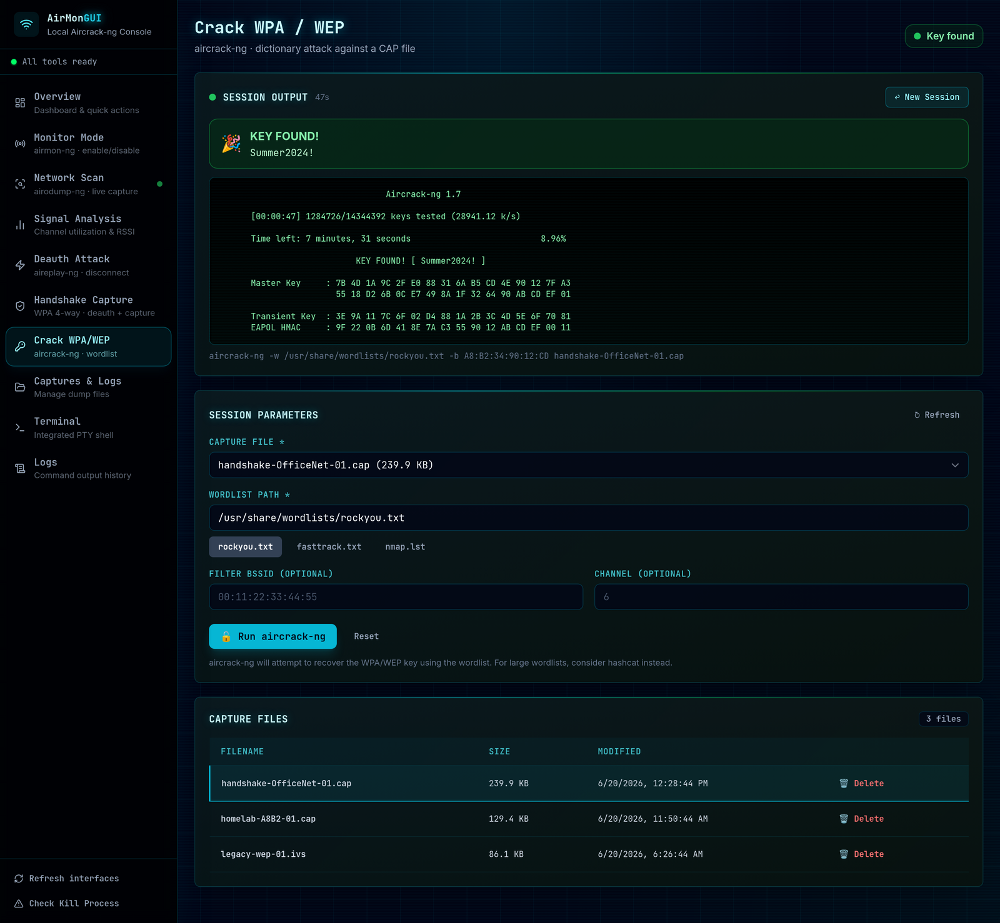
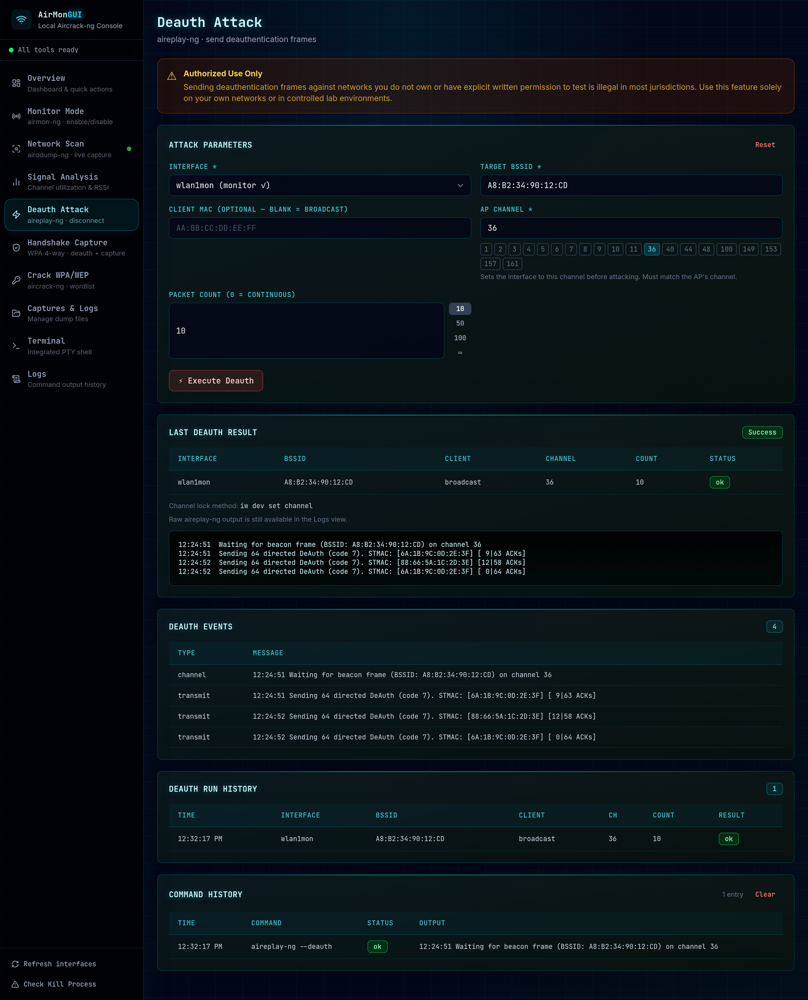
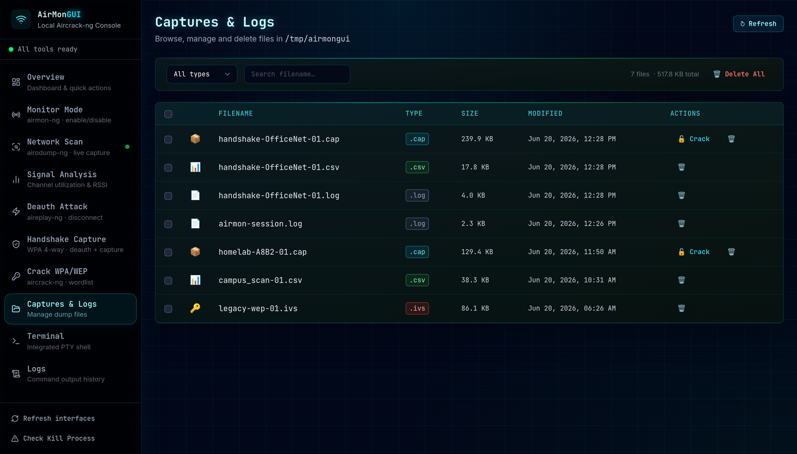
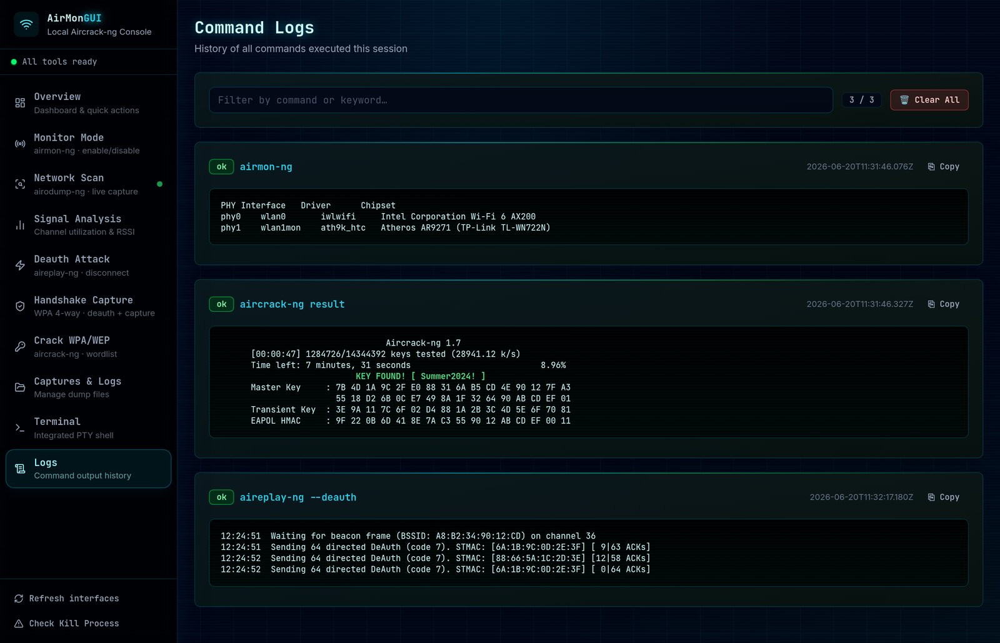

<div align="center">

# AirmonGUI

A local web interface for the aircrack-ng wireless toolkit.

[](LICENSE)
[](#requirements)
[](https://github.com/ELHart05/AirmonGUI/actions/workflows/ci.yml)
[](https://github.com/ELHart05/AirmonGUI/commits)
[](CONTRIBUTING.md)
[](https://github.com/ELHart05/AirmonGUI/stargazers)

[Screenshots](#how-it-works) · [Quick start](#quick-start) · [Features](#features) · [Roadmap](#roadmap) · [Contributing](#contributing)



</div>

<br/>

> [!WARNING]
> Use this only on networks you own or have written permission to test. Scanning, deauthenticating, or capturing traffic from networks you don't control is illegal in most places. See [Legal and responsible use](#legal-and-responsible-use).

---

## What it is

AirmonGUI puts `airmon-ng`, `airodump-ng`, `aireplay-ng`, and `aircrack-ng` behind one web app that runs on your own machine. You enable monitor mode, scan for networks, capture a WPA handshake, and crack it by clicking through labelled forms instead of remembering flags.

It does not reimplement any of the tools. The backend shells out to the real binaries and parses their output, so what you see is what the suite actually did. The UI binds to `127.0.0.1` and the API never reaches outside your machine.

## Why I built it

The aircrack-ng suite is excellent, but the workflow lives across four separate commands and a lot of flags you have to keep in your head: put the card in monitor mode, hop channels to find a target, lock onto a BSSID, fire deauth on the correct channel, wait for the four-way handshake, then feed the capture into a wordlist. Miss the channel and the deauth goes nowhere. Forget `--bssid` and your capture is full of noise.

I wanted that whole sequence as a set of screens that walk you through it, show you what's on the air, and keep the state straight between steps. That is what this is. It works well for learning how the attacks actually behave, for lab work, and for speeding up an authorized assessment.

## Features

| Area | What it does |
|---|---|
| Monitor mode | Enable or disable monitor mode on a chosen interface with `airmon-ng`. A separate check-kill action runs `airmon-ng check kill` when background services like NetworkManager are blocking monitor mode. |
| Network scanning | Runs `airodump-ng` capture jobs and shows access points and clients in a live table you can filter by name, security, or band. |
| Signal analysis | Ranks access points by how attackable they are (signal strength, weak security, active clients) and charts channel congestion and the security mix in range. |
| Deauthentication | Sends targeted or broadcast deauth through `aireplay-ng`, setting the interface to the access point's channel first so the frames land. |
| Handshake capture | A three-step workflow that locks `airodump-ng` to a target, runs an auto-deauth engine, and detects the WPA four-way handshake on its own. |
| Cracking | Feeds a capture and a wordlist to `aircrack-ng`, streams the live log, and shows the recovered key the moment it appears. |
| Capture management | Browse, filter, bulk-select, and delete the `.cap`, `.csv`, `.pcap`, `.ivs`, and `.log` files the suite writes. |
| Integrated terminal | A real PTY shell (xterm.js) for when you want the raw command line in the same window. |
| Command logs | Every command run in the session, with stdout, stderr, status, and one-click copy. |

## How it works

A run moves top to bottom down the sidebar. Here is each screen.

> The networks, BSSIDs, and clients in the screenshots below are synthetic demo data, not a real capture.

### 1. Put the adapter in monitor mode

Pick an interface, check its driver, chipset, and PHY, and switch monitor mode on. Release just that interface when you're done.

<div align="center"></div>

### 2. Scan the air

Start an `airodump-ng` job and watch access points and clients fill in as they're found. Filter the table, then send any network straight to a deauth or handshake workflow.

<div align="center"></div>

### 3. Pick a target

Signal Analysis scores every access point so the strong, weakly-secured ones with active clients rise to the top. It also shows how busy each channel is and what security the surrounding networks use. Your own devices get flagged so you don't point anything at yourself by mistake.

<div align="center"></div>

### 4. Capture the handshake

This screen locks `airodump-ng` to the target's BSSID and channel, runs the auto-deauth engine to knock clients off so they reconnect, and turns green the instant a four-way handshake is captured.

<div align="center"></div>

### 5. Crack it

Point `aircrack-ng` at the capture and a wordlist. The log streams as it runs, and if the passphrase is in your list, it shows up at the top.

<div align="center"></div>

<details>
<summary>More screens: deauth, captures, logs</summary>

<br/>

Standalone deauth with channel locking, run history, and parsed event output:

<div align="center"></div>

Capture file management:

<div align="center"></div>

Session command history:

<div align="center"></div>

</details>

## Quick start

You need Linux, root, a wireless adapter that supports monitor mode, and the aircrack-ng suite on your `$PATH`. See [Requirements](#requirements) for the full list.

```bash
# 0. Install the suite (Debian, Ubuntu, Kali)
sudo apt update && sudo apt install aircrack-ng wireless-tools

# 1. Clone
git clone https://github.com/ELHart05/AirmonGUI.git
cd AirmonGUI

# 2. Backend (terminal 1)
cd backend
python3 -m venv .venv && source .venv/bin/activate
pip install -r requirements.txt
sudo -E .venv/bin/uvicorn main:app --host 127.0.0.1 --port 8000

# 3. Frontend (terminal 2)
cd frontend
npm install
npm run dev
```

Open http://localhost:5173. The UI only talks to `127.0.0.1:8000`.

Root is needed because `airmon-ng`, `airodump-ng`, and `aireplay-ng` use raw sockets. Call `.venv/bin/uvicorn` directly rather than plain `uvicorn`, since `sudo` resets `PATH` and would otherwise miss the virtualenv; the `-E` flag keeps any `AIRMON_GUI_*` variables you set. If you'd rather not run the server as root, set up passwordless `sudo` for those specific binaries and adjust `backend/app/utils.py`.

<details>
<summary>Production build</summary>

<br/>

```bash
cd frontend
npm run build   # writes static files to frontend/dist/
```

Serve `frontend/dist/` from any static file server and proxy `/api/*` and the `/ws/*` WebSocket to the Uvicorn process.

</details>

## Tech stack

| Layer | Stack |
|---|---|
| Backend | Python 3.11+, FastAPI, Uvicorn, Pydantic v2 |
| Frontend | Vue 3, Vite 5, Tailwind CSS 3, lucide-vue-next, xterm.js |
| Website | React 18, TypeScript, Vite, Tailwind (the optional landing page in `website/`) |

## Architecture

```
AirmonGUI
├── backend/    FastAPI REST API and WebSocket, one route module per tool
│               app/routes/ (interfaces, airodump, aireplay, aircrack, handshake, captures)
│               app/models.py (validated Pydantic I/O), app/state.py (in-process job registry)
│               app/utils.py (subprocess and sudo logic), app/config.py (env config)
│
├── frontend/   Vue 3 single-page app, the control console
│               views/ (Overview, Monitor, Scan, Signal, Deauth, Handshake, Crack, Captures, Reports, Terminal, Logs)
│               composables/ (reactive job and state logic), api/ (fetch wrappers)
│
└── website/    Standalone React landing site (optional)
```

The backend serves a REST API at `http://127.0.0.1:8000/api` and a terminal WebSocket at `/ws/terminal`. In development the Vite dev server on `:5173` proxies both to the backend.

<details>
<summary>API reference</summary>

<br/>

Interactive schemas are at `http://127.0.0.1:8000/docs` (Swagger UI), `/redoc`, and `/openapi.json` while the backend runs.

| Method | Endpoint | Description |
|---|---|---|
| GET | `/api/health` | Server health check |
| GET | `/api/toolcheck` | Check that the aircrack-ng tools are installed |
| GET | `/api/interfaces` | List wireless interfaces with MAC and monitor status |
| POST | `/api/monitor` | Start or stop monitor mode |
| POST | `/api/checkkill` | Run `airmon-ng check kill` to stop interfering services |
| GET | `/api/airodump/jobs` | List running and known capture jobs |
| POST | `/api/airodump/start` | Start an `airodump-ng` scan job |
| POST | `/api/airodump/stop` | Stop a scan job by id |
| GET | `/api/airodump/results/{job_id}` | Parsed scan results (networks and clients) |
| POST | `/api/aireplay/deauth/start` | Start a deauth job |
| GET | `/api/aireplay/deauth/jobs` | List deauth jobs |
| GET | `/api/aireplay/deauth/{job_id}/status` | Poll a deauth job |
| POST | `/api/aireplay/deauth/{job_id}/stop` | Stop a deauth job |
| POST | `/api/handshake/start` | Start a targeted handshake capture |
| GET | `/api/handshake/jobs` | List handshake capture jobs |
| GET | `/api/handshake/{job_id}/status` | Poll handshake detection |
| POST | `/api/handshake/{job_id}/stop` | Stop a handshake capture |
| GET | `/api/aircrack/jobs` | List crack jobs |
| GET | `/api/aircrack/validate?path=<file>` | Check whether a capture holds a handshake |
| POST | `/api/aircrack/crack` | Start an `aircrack-ng` wordlist job |
| GET | `/api/aircrack/{job_id}/status` | Poll crack status and recent log output |
| POST | `/api/aircrack/{job_id}/stop` | Stop a crack job |
| GET | `/api/captures` | List capture files |
| GET | `/api/captures/cap` | List crackable `.cap`, `.pcap`, and `.ivs` files |
| DELETE | `/api/captures/{filename}` | Delete a capture file |
| WS | `/ws/terminal` | Interactive PTY terminal |

</details>

<details>
<summary>Configuration</summary>

<br/>

The backend runs with the defaults below, so you only need these to change them. Export the variables before starting Uvicorn — they are read from the environment, not auto-loaded from a `.env` file. See `backend/.env.example` for the full list.

| Variable | Default | Description |
|---|---|---|
| `AIRMON_GUI_CAPTURE_DIR` | `/tmp/airmongui` | Where capture files are written |
| `CORS_ORIGINS` | `http://localhost:5173` | Comma-separated allowed origins |
| `API_HOST` | `127.0.0.1` | Host Uvicorn binds to |
| `API_PORT` | `8000` | Port Uvicorn listens on |

```bash
export AIRMON_GUI_CAPTURE_DIR=/home/user/captures
sudo -E .venv/bin/uvicorn main:app --host 127.0.0.1 --port 8000
```

</details>

## Requirements

| Requirement | Notes |
|---|---|
| Linux (kernel 4.x+) | Tested on Kali Linux and Ubuntu 22.04 |
| Monitor-mode wireless adapter | For example an Atheros AR9271 or another common pentest chipset |
| aircrack-ng suite | `airmon-ng`, `airodump-ng`, `aireplay-ng`, `aircrack-ng` on `$PATH` |
| `wireless-tools` (`iwconfig`) | Used for channel tuning |
| Root privileges | Required by the aircrack-ng tools |
| Python 3.11+ and Node.js 18+ | Backend and frontend toolchains |

## Roadmap

Help on any of these is welcome. See [Contributing](#contributing).

- One-command launcher (a Makefile target or Docker Compose) for backend and frontend
- A `hashcat` hand-off for GPU cracking
- PMKID capture and attack
- Client and AP graphs over time
- The Reports view, finished and exportable
- Authentication for non-loopback setups
- A packaged release and install script

Have an idea? [Open an issue](https://github.com/ELHart05/AirmonGUI/issues/new). Feature requests and questions are fine.

## Contributing

Pull requests are welcome, and the smaller and more focused the better.

1. Read [CONTRIBUTING.md](CONTRIBUTING.md) for setup, verification, and the safety rules.
2. Fork, branch, and keep the change scoped to one thing.
3. Check that the backend (`uvicorn`) and frontend (`npm run dev`) both start clean.
4. Open a PR that says what changed and why.

Each folder has its own README with notes: [backend](backend/README.md), [frontend](frontend/README.md), [website](website/README.md).

If the project is useful to you, a star helps other people find it and tells me it's worth continuing.

## Star history

<div align="center">

[](https://star-history.com/#ELHart05/AirmonGUI&Date)

</div>

## Legal and responsible use

AirmonGUI is for authorized wireless testing, research, and teaching on networks you own or have written permission to assess.

Intercepting traffic and deauthenticating networks or devices you don't control is illegal in most jurisdictions. The defaults keep both the API and the dev server on loopback for a reason, so don't expose them on a shared or public network. The authors take no responsibility for misuse. By using this software you confirm you have permission for every network and device you touch.

Use it to understand and defend networks, not to attack ones that aren't yours.

## License

MIT, see [LICENSE](LICENSE). Built on top of the [aircrack-ng](https://www.aircrack-ng.org/) project, which does the actual work.
